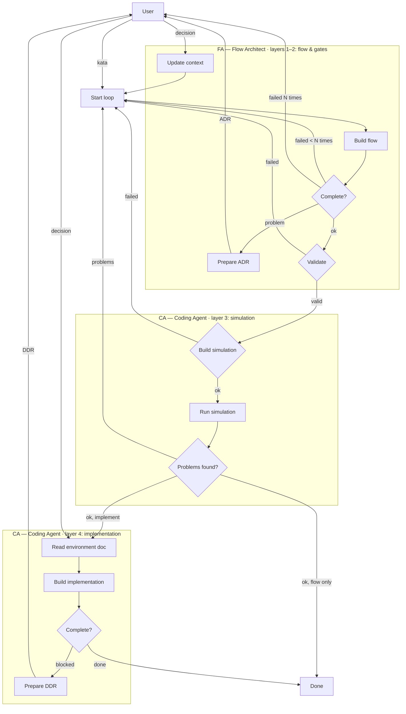
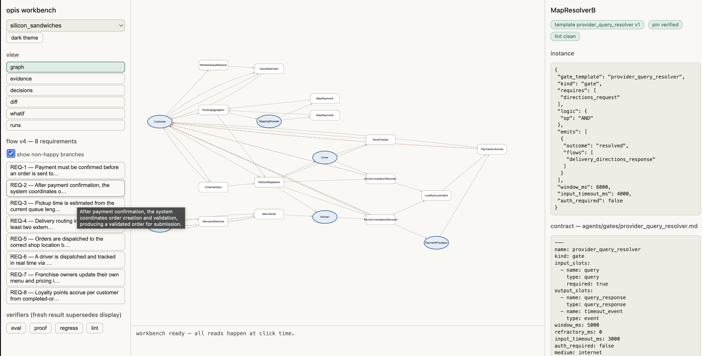

# Opis — verifiable, agent-generated dynamic software architecture

Opis is a research prototype exploring a question at the intersection of LLM agents and software architecture:

> **When an AI agent designs a system's architecture, can we *check* that design structurally — proving it satisfies its requirements — instead of trusting the prose the model wrote about it? When the infrastructure or usage patterns change, will the architecture adapt?**

Most "AI architect" tooling ends at generation: the model emits a diagram or a description, and a human eyeballs it. Opis treats the generated architecture as a formal object. An agent produces a machine-readable flow specification; a static analyzer and a requirement prover then verify that specification the way a compiler front-end verifies a program — before anyone trusts a word of the model's explanation. And because that architecture is a generated, verified artifact rather than hand-maintained code, adapting to changed infrastructure or usage is a *regeneration* — re-run the agent, re-verify — not a manual refactor. That is the *dynamic* in dynamic software architecture.

> **Conceptual foundation:** Opis is one concrete answer to the argument in [*AI Coding Design Patterns?*](https://zarkob.substack.com/p/ai-coding-design-patterns) — that as AI moves code creation to the requirements level, we validate agent-built systems either with an *LLM-as-judge* (easy to iterate, unreliable) or with a *DSL/ontology whose evaluation is constructed via graph algorithms* (harder to build, reliable to reason with in code). **Opis is a deliberate bet on the ontology branch:** the pulse-network is the ontology, and `opis-proof`'s fixed-point reachability with real witness paths is that graph-algorithm evaluation, made concrete.

## Opis Architecture

Opis represents a target architecture as a well-defined hierarchy of four description layers, each more concrete than the one above it:

1. **Flow** — the top level of abstraction. A flow contains:
   - a domain-specific taxonomy of terms (archetypes extending computing-level slot types),
   - the network topology: loci wired through custom or predefined operators called *gates*, which consume and produce typed *signals* (pulses) over synapses, and
   - the binding map from domain-specific signal names to the gates' generic slot-type terminology.
2. **Gates** — the operators the flow is wired from. A gate contract outlines one operation (validating an order, authorizing a payment) as typed input/output slots, join logic, timing windows, and outcome bundles. Gates are kata-agnostic, versioned, and pinned by every flow that uses them — a shared library, not per-kata artifacts.
3. **Simulation** — the executable twin of a flow: Monte-Carlo dynamics over the topology, statistical emulation of everything that isn't software, and progressive substitution of real gate code (co-simulation). One simulation per flow; it validates the flow's dynamics and prices its timing.
4. **Implementation** — real code in a real environment: gates compiled to wasm, message schemas on the wire, environment documents describing the infrastructure. One flow × n environments = n implementations; measured parameters feed back into the simulation.

Two agents own the four layers, with the User as the only decision authority:

- **FA — Flow Architect** owns layers 1–2. It designs flows and, when a kata needs a primitive that doesn't exist, proposes or amends gate contracts — always through **ADRs** the User decides.
- **CA — Coding Agent** owns layers 3–4. It translates contracts into message schemas, builds and runs the simulation, implements gates as real code, and measures. Design decisions at the implementation layer travel through **DDRs**.

Escalation is structural: evidence from a lower layer can falsify the layer above it — a contract that can't be translated into usable messages, a simulation that starves a gate, an implementation that contradicts the simulation. The fix happens at the layer that owns the problem, not by patching downstream.

### The Reasoning Loop



Both decision channels terminate at the User: **ADRs** carry flow- and gate-layer trade-offs (FA), **DDRs** carry implementation-layer ones (CA). Every decision becomes binding context injected into all subsequent iterations — rejections included.


### The bigger arc: two agent loops and an outer loop

A flow is only the top layer. The full system Opis is building toward is **two nested, self-closing verification loops** over the four layers:

- **FA — Flow Architect** *(built)* — owns layers 1–2. Designs the flow-level pulse network and stewards the gate library it draws from; verified by `opis-eval` + `opis-proof`; every contract proposal or amendment is an ADR the User decides.
- **CA — Coding Agent** *(in progress)* — owns layers 3–4. Flow-scoped, not gate-scoped, because measured behavior is a reaction of the whole system — per-gate PDs don't compose (one validator's decision logic changes every distribution downstream of it). CA translates gates + ADRs into shared per-archetype message schemas (a contract that can't be translated into usable messages is falsified before any code runs), implements gates against them, emulates non-software subsystems statistically, and runs the flow in the co-simulation twin: real code where code will exist, statistics where the world is. Sandbox measurements *falsify* contracts confidently but *validate* them only weakly — lower bounds, never production numbers.

The loops *compose and feed back*: CA evidence that falsifies a contract reopens the gate's ADR, which invalidates any flow that pinned it — and that signal propagates back up so the responsible agent re-designs, not a human. Closing that path end-to-end is the actual research contribution. FA and its verification stack stand on their own and are fully working; the feedback path is what turns the separate checkers into one coherent, self-correcting system.

Encircling it all is an outer loop that closes differently: **real-use feedback.** The inner loops shift *correctness* left — they settle valid, safe, and efficient before a line runs. But *useful* can only be judged once the system meets real participants, and that judgment doesn't return a pass/fail, it returns a **revision.** Observed usage sends a signal all the way back out: sometimes the architecture was wrong for the right problem (regenerate the flow), sometimes the problem itself was wrong (rewrite the kata — the requirements "code"). This is the loop that makes the requirements themselves editable, not just the design beneath them, and it's the one no graph algorithm can close on its own.

**This is a work in progress, and the real proof is use.** The katas here are internal evals — a controlled way to force each new primitive into existence. The bar Opis is aiming at isn't "passes its own tests"; it's *being used to design and verify a system someone actually ships.* That's the milestone that matters, and it isn't reached yet.

---

## The model

Opis describes any system as a **pulse network**:

- **Loci** — actors, services, sensors, or stores (the nodes).
- **Synapses** — typed connections carrying *pulses* between loci (the edges).
- **Gates** — operators that fire when all their required input types arrive within a time window, then emit outcome pulses downstream.

Two vocabularies are kept strictly separate:

- **Slot types** — computing-level primitives that gates are defined over (`order`, `payment`, `auth_token`, `event`, …). Gates are *kata-agnostic*: a `payment_processor` knows nothing about sandwiches or ride-hailing.
- **Domain terms** — problem-specific concepts that extend slot types by IS-A (`sandwich_order` **is-a** `order`). The analyzer is subtype-aware, so a gate requiring `order` is satisfied by a `sandwich_order`.

A design problem is posed as a **kata** (a short architecture brief). The agent's job is to turn a kata into a valid, verified flow.

---

## What Opis verifies: useful, valid, safe, efficient

The [essay](https://zarkob.substack.com/p/ai-coding-design-patterns) argues an agent-built system must be shown to be **useful, valid, safe, and efficient**. Three of those four are structural properties a graph-based verifier can check mechanically — and Opis does. The fourth can't be, by nature, which is exactly why usage is the milestone that matters:

| Property | How Opis checks it |
|----------|-------------------|
| **Valid** | `opis-proof` reconstructs a real path for every requirement's every required input; gate-conformance confirms each instance honors its template's full contract. "All requirements covered" is never accepted as prose. |
| **Safe** | `opis-eval` flags any gate reachable from an untrusted `source` locus without an intervening sentinel, and any protected gate lacking upstream auth — improper authorization, the decades-old top risk, made a static check. |
| **Efficient** | `opis-eval` surfaces window-feasibility violations, cardinality/scaling ceilings, and `sync`-gate consistency boundaries — the business and physical constraints that used to live only in an architect's head. |
| **Useful** | *Not statically checkable.* Usefulness is a feedback loop with real participants; no graph algorithm settles it. It closes only through **real-use feedback** — usage that can send the system back to regenerate the architecture, or to rewrite the kata itself. This is why the real bar is Opis being **used**, not passing its own katas. |

"Who validates the validator?" — the essay's own question — is answered by construction: `eval` and `proof` are entirely domain-agnostic, so validating the validation process is the more general, more tractable problem, solved once and reused across every domain.

## The verification stack — the core of the project

### `opis-eval` — static structural analysis

Analogous to Petri-net structural analysis: *"is this topology sound?"*, answered before a single pulse is injected. Fourteen checks, including reachability (can every gate's `requires` ever be satisfied?), orphan detection, cycle (SCC) reporting, sentinel/auth coverage, cardinality and scaling ceilings, consistency boundaries for `sync` gates, emit coverage, and gate-logic operators (`AND` / `OR` / `FIRST` / `THRESHOLD`, optional inputs, circuit breakers). Three-tier exit codes: `0` clean, `1` structural error, `2` warnings only.

### `opis-proof` — requirement-coverage prover

Where `opis-eval` asks *"is the topology sound?"*, `opis-proof` asks *"does every requirement the agent claims to have covered actually have a real path through the graph?"* For each requirement, and for each of the target gate's required input types, it reconstructs the literal witness path (`source locus → … → target gate`) that satisfies it — the same trace a human would do by hand on the diagram.

Reachability is computed as a proper **AND-join fixed point**: a gate contributes its emitted types only once *all* of its non-optional required types have genuinely arrived via real upstream propagation. Genuine requires-cycles fall back to a conservative assumption, but every such fallback is explicitly marked — never presented as a clean trace. It also includes a **gate-conformance** check (does a gate instance honor the full input contract of the template it claims?) and a **wiring-gap vs. no-domain-source** diagnosis (is an unreachable input just an unwired synapse, or a type nothing in the flow ever produces — a sign the wrong gate was chosen?).

### `opis-regress` — regression harness

Every committed flow passed the full gate when it was written, so the set of committed flows is a golden corpus. `regress.py` re-runs eval + requirement proofs + conformance + gate-index consistency against each kata's canonical flow, so a change to the analyzer or the gate library can't silently break a previously-verified design.

---

## Quickstart

```bash
# structural analysis of a verified flow
python tools/opis-eval/eval.py workspace/ripple_rides/flow/flow_v2.json

# reconstruct the witness path for every requirement in that flow
python tools/opis-eval/proof.py workspace/ripple_rides/flow/flow_v2.json

# re-verify the entire golden corpus + gate-index consistency
python tools/opis-eval/regress.py
```

The analyzer and prover are pure-stdlib Python — no dependencies, no graph database. A "proof" is just the reconstructed path, written out as a list of hops.

To run the agent itself (requires an Anthropic API key in `.env`):

```bash
python -m agents.fa.runner agents/katas/ripple_rides.md
```

---

## How the agent (FA — Flow Architect) works

FA iterates against a scratch file and only promotes a real `flow_vN.json` once the flow is simultaneously **eval-clean**, **requirement-proved**, and **gate-conformant** — three independent gates, not the model's own say-so. Supporting machinery:

- **Missing primitives become decisions, not hallucinations.** If a kata needs a gate that doesn't exist, FA doesn't invent one — it writes an **ADR** (architecture decision record) proposing the gate with trade-off options, and stops for human approval. An approved ADR seeds a *draft* gate file — a trigger for the gate-refinement process below, not an authoritative contract. These mid-run ADRs are deliberately weak evidence and are never traced as a contract's justification.
- **Defect memory across runs.** Every structural defect is fingerprinted and persisted, with fixed / outstanding / reopened counts that survive separate invocations. A defect that keeps recurring nudges FA to propose a *new gate* via ADR rather than rewiring around a need that doesn't fit any existing primitive.
- **The gate index is derived, not narrated.** Each gate's index row is computed deterministically from its own frontmatter, and a consistency check guarantees the index and the gate files on disk can never drift.

---

## Verified katas

| Kata | Flow | Requirements proved | Exercises |
|------|------|---------------------|-----------|
| `silicon_sandwiches` | `flow_v1` | 8/8 | core gate/synapse/subtype model |
| `encore_tickets` | `flow_v1` | 8/8 | cross-domain gate reuse, conformance |
| `ripple_rides` | `flow_v2` | 12/12 | `regulator` kind, `THRESHOLD` logic, circuit breakers |

Each was independently re-verified by running the analyzer and prover directly against the committed file, not by trusting the agent's own success report.

Everything under `workspace/` (repo root, ignored here) is the agents' **local workspace — its own git repo, never pushed**: katas re-run from a blank slate, flows serve as regression baselines for `regress.py` (a local test), and the agents commit their own runs there. ADRs, logs, and defect histories document past runs — not design artifacts, no authority.

---

## The gate library is seed stock — refining it is the research

Every gate contract carries a lifecycle `status` (`draft` → `specified` → `simulated` → `measured`; the last meaning *sandbox-measured* — a feasibility verdict and lower bounds from CA, not production validation) and a `confidence` provenance tag (`llm-estimate` | `twin-validated` | `sourced`) in its frontmatter. The current 14 contracts were proposed one-shot during early kata runs: they exist to bootstrap the loops, and all of them are tagged `llm-estimate`.

A contract is **promoted only with evidence** — grounding in real-life architectures (published benchmarks, named analogs like payment authorization flows or the circuit-breaker pattern) or high-quality sandboxed twin runs. Promotion is iterative: **ADR → specs → implementation**, where each stage can also *demote* the one above it (a twin run that falsifies a window reopens the spec; a measured implementation that contradicts the simulation reopens the ADR). Building good gate descriptions and building the refinement process that produces them are the same open research question, worked at the same time.

---

## Architect UI Sample



---

## Repo layout

```
agents/
  fa/                # Flow Architect agent (run loop, prompts)
  gates/             # kata-agnostic gate library + index.md
  slot_types/        # computing-level type definitions
  katas/, input/     # architecture problems
workspace/<kata>/    # agents' local workspace repo (ignored): flows, ADRs, run logs
tools/
  opis-eval/         # eval.py, proof.py, regress.py
```

---

## Status & roadmap

This is an active research prototype, not a product — see [the bigger arc](#the-bigger-arc-two-agent-loops-and-an-outer-loop) for the full vision.

- **Built and working:** the pulse-network model, the `opis-eval` / `opis-proof` / `opis-regress` verification stack, the Rust Monte-Carlo **twin** (`da-twin` + `twin_check`: subtype- and logic-aware simulation, latency library, advisory timing norms), and **FA** — the flow-level loop, closed end-to-end.
- **Seed stock, being refined:** the gate library — 14 draft contracts tagged `llm-estimate`, awaiting promotion through the ADR → specs → implementation cycle (see above).
- **In progress — closing the lower layers:** **CA** as owner of the simulation and implementation layers (schemas → Rust/wasm gate implementations → co-sim runs with statistically emulated externals → feasibility verdicts + measured lower bounds; one translation per environment document), plus the feedback path that lets lower-layer evidence demote and re-trigger the layers above it. Gate-internals tooling (`gate_proof`, the twin's advisory timing norms) persists as verifiers in this loop. First vertical slice: `silicon_sandwiches` in the co-sim twin.
- **The outer loop:** real-use feedback — a path from observed usage back into the system that can regenerate the architecture or rewrite the kata. This is what closes *usefulness*, and it's the loop no static check can substitute for.
- **The real milestone:** applying the closed loop to a system that actually gets used, not just katas.

## Design principles

- Structural claims are verified, never described. "All requirements covered" is worthless without a reconstructed path.
- Gates are reusable computing primitives; domain knowledge lives only in the type taxonomy.
- Missing capability is a design decision (an ADR), not something the agent papers over.
- Provenance is never silent: every timing number and contract is tagged with how it was obtained (`llm-estimate` | `twin-validated` | `sourced`), and estimates are never mixed with evidence.
- The tools are stateless and file-based on purpose — the artifacts *are* the proof.
